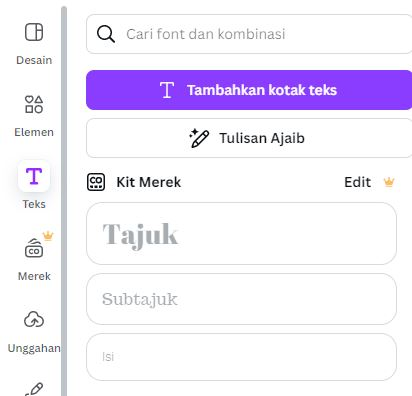

# Membuat Mockup Website Jual Beli Menggunakan Canva

## Description
Membuat mockup situs web merupakan langkah awal dalam pembuatan website. Rancangan yang dibuat dapat digunakan sebagai user interface web yang ingin dihasilkan, terutama jika anda ingin melakukan transaksi secara digital, sehingga hal ini penting untuk dilakukan. Berikut cara membuat mockup website jual beli menggunakan Canva.

## Requirements
> - __*Device*__ (disarankan menggunakan PC)
> - __*Browser*__ (disarankan menggunakan **Chrome**)
> - **Canva**

## Installation
> 1. Sambungkan koneksi internet dengan perangkat anda.
> 2. Masuk ke browser pilihan anda, masuk ke halaman Canva {[Click Here](https://www.canva.com)}.
> 3. Silahkan login ke akun anda.
> 4. Setelah berhasil login, pilih **situs web** untuk mulai merancang web.
> 5. Untuk membuat header, anda dapat menggunakan fitur `element` pada website canva, lalu pilih bentuk `element` yang anda inginkan. Sesuaikan ukuran berdasarkan preferensi anda. Fitur ini juga dapat anda gunakan untuk menambahkan *icon* dan tombol *buy here* jika diperlukan.
>
>

> 6. Untuk mengubah warna background, anda dapat melakukan click pada background, dan memilih warna background sesuai keinginan anda.

> 7. Untuk memasukkan foto pada halaman anda, gunakan fitur `foto` yang terletak pada side bar.

> 8. Untuk menambahkan teks, lihat pada side bar dan pilih fitur `teks` lalu pilih `tambahkan kotak teks`

> 9. Sesuaikan posisi setiap fitur sesuai kebutuhan anda dengan `drag item`.
> 10. Jika sudah selesai, pilih `publikasikan situs web` yang terletak pada menu.

> 11. Mockup Web anda siap ditampilkan.
